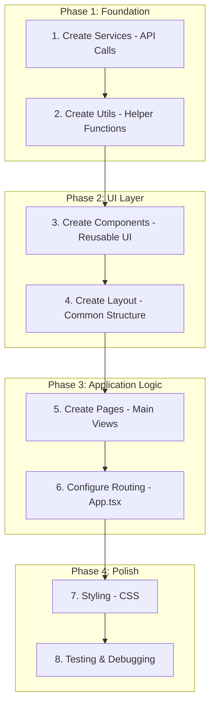
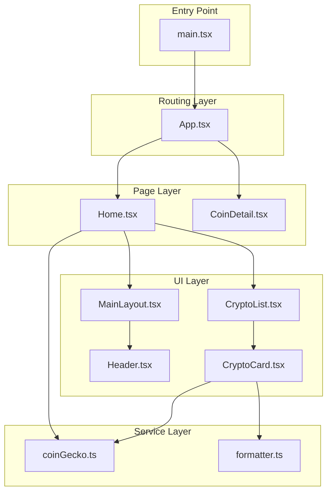
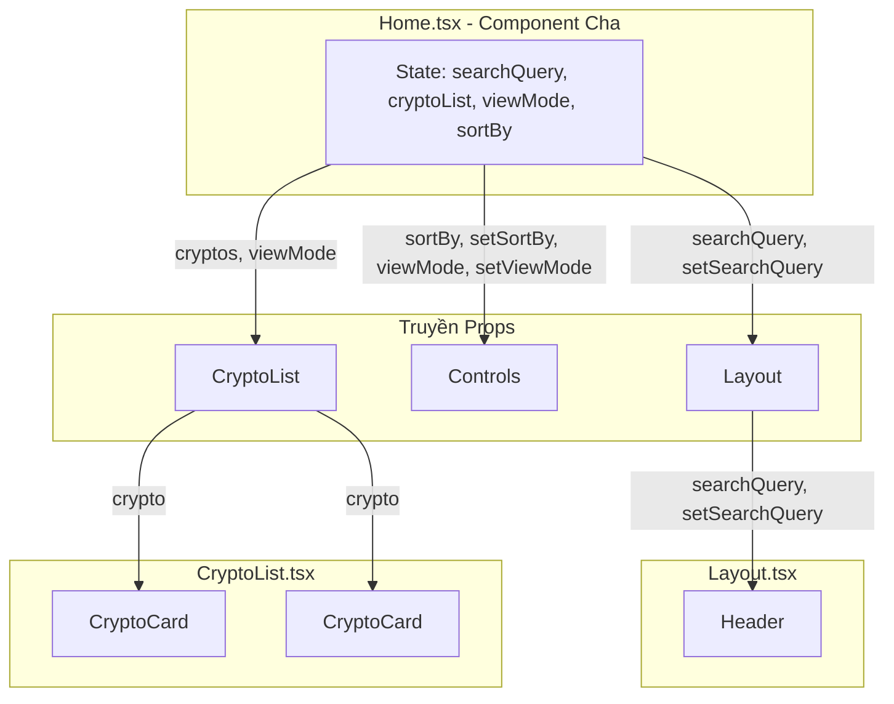
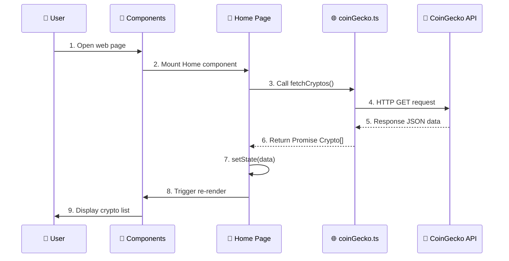

# XÂY DỰNG CRYPTO TRACKER

---

## MỤC LỤC

1. [Cài Đặt Môi Trường](#1-cài-đặt-môi-trường)
2. [Khởi Tạo Dự Án](#2-khởi-tạo-dự-án)
3. [Cấu Trúc Thư Mục](#3-cấu-trúc-thư-mục)
4. [Workflow Phát Triển](#4-workflow-phát-triển)
5. [Cách Code Được Sử Dụng Trong Nhau](#5-cách-code-được-sử-dụng-trong-nhau)
6. [Code Dự Án Với Giải Thích Chi Tiết](#6-code-dự-án-với-giải-thích-chi-tiết)
7. [Các Lệnh Thường Dùng](#7-các-lệnh-thường-dùng)

---

## 1. CÀI ĐẶT MÔI TRƯỜNG 💻

### 1.1. Yêu Cầu Phần Mềm

| Phần mềm                  | Phiên bản tối thiểu  | Link tải                                                |
| ------------------------- | -------------------- | ------------------------------------------------------- |
| **Node.js**               | v18+                 | [nodejs.org](https://nodejs.org/)                       |
| **npm**                   | v9+ (đi kèm Node.js) | -                                                       |
| **VS Code** (khuyến nghị) | Latest               | [code.visualstudio.com](https://code.visualstudio.com/) |

### 1.2. Kiểm Tra Cài Đặt

```bash
# Kiểm tra Node.js
node --version
# Output mong đợi: v18.x.x hoặc cao hơn

# Kiểm tra npm
npm --version
# Output mong đợi: 9.x.x hoặc cao hơn
```

### 1.3. Extensions VS Code Khuyến Nghị

- **ES6+ React/Redux/React-Native snippets** - Gõ code nhanh
- **TypeScript Importer** - Auto import
- **Prettier** - Format code tự động
- **ESLint** - Bắt lỗi code

---

## 2. KHỞI TẠO DỰ ÁN 🚀

### 2.1. Tạo Dự Án Mới

```bash
# Chạy lệnh tạo project với Vite + React + TypeScript
npm create vite@latest crypto -- --template react-ts

# Di chuyển vào thư mục dự án
cd crypto

# Cài đặt dependencies
npm install
```

### 2.2. Cài Đặt Thêm Dependencies

```bash
# React Router - Điều hướng trang
npm install react-router-dom

# Recharts - Vẽ biểu đồ (tùy chọn)
npm install recharts
```

### 2.3. Chạy Dự Án

```bash
# Khởi động development server
npm run dev

# Mở trình duyệt tại: http://localhost:5173
```

---

## 3. CẤU TRÚC THƯ MỤC 📁

Sau khi tạo project, tổ chức lại cấu trúc thư mục như sau:

```
crypto/
├── 📄 index.html          # Entry point HTML
├── 📄 package.json        # Dependencies & scripts
├── 📄 vite.config.ts      # Cấu hình Vite
├── 📄 tsconfig.json       # Cấu hình TypeScript
│
└── 📁 src/
    ├── 📄 main.tsx        # Entry point React (render App)
    ├── 📄 App.tsx         # Routing & Layout tổng thể
    ├── 📄 index.css       # CSS toàn cục
    │
    ├── 📁 services/       # ⭐ Gọi API
    │   └── coinGecko.ts
    │
    ├── 📁 utils/          # ⭐ Hàm tiện ích
    │   └── formatter.ts
    │
    ├── 📁 components/     # ⭐ UI Components nhỏ
    │   ├── Header.tsx
    │   ├── Footer.tsx
    │   ├── CryptoCard.tsx
    │   ├── CryptoList.tsx
    │   ├── Loading.tsx
    │   └── ...
    │
    ├── 📁 layout/         # ⭐ Layout chung
    │   └── MainLayout.tsx
    │
    └── 📁 pages/          # ⭐ Các trang chính
        ├── Home.tsx
        ├── CoinDetail.tsx
        └── CryptoNews.tsx
```

### Tạo Thư Mục (Chạy trong terminal)

```bash
# Từ thư mục gốc dự án
mkdir src/services
mkdir src/utils
mkdir src/components
mkdir src/layout
mkdir src/pages
```

---

## 4. WORKFLOW PHÁT TRIỂN 🔄



### Nguyên Tắc Vàng

1. **Bottom-up**: Xây từ nhỏ đến lớn (services → utils → components → pages)
2. **Single Responsibility**: Mỗi file làm 1 việc
3. **DRY**: Don't Repeat Yourself - Tái sử dụng code

---

## 5. CÁCH CODE ĐƯỢC SỬ DỤNG TRONG NHAU 🔗

### Sơ Đồ Phụ Thuộc (Dependency Graph)



### Chi Tiết Luồng Import

#### 📄 `main.tsx` → `App.tsx`

```typescript
// main.tsx
import App from "./App.tsx";

createRoot(document.getElementById("root")!).render(<App />);
```

```typescript
import App from "./App.tsx";
```

Dòng này import component gốc của ứng dụng — App. File App.tsx chứa toàn bộ layout chính, router hoặc toàn bộ logic giao diện của ứng dụng React.

Khi ứng dụng được render, React sẽ bắt đầu từ component App rồi lan ra các component con.

#### `createRoot(...)`

createRoot là API của React 18 dùng để khởi tạo "root" — điểm bắt đầu để React quản lý UI.

#### `document.getElementById("root")!`

Lấy phần tử HTML có id="root" từ file index.html.

#### `render(<App />)`

Sau khi tạo root, React sẽ render component `<App />` vào bên trong thẻ <div id="root">. Đây là điểm bắt đầu để React tạo cây component (Virtual DOM) và gắn nó vào DOM thật.

#### 📄 `App.tsx` → Pages

```typescript
// App.tsx
import { Home } from "./pages/Home.tsx";
import { CoinDetail } from "./pages/CoinDetail.tsx";

<Routes>
  <Route path="/" element={<Home />} />
  <Route path="/coin/:id" element={<CoinDetail />} />
</Routes>;
```

Trong file `App.tsx`, ứng dụng import hai trang `Home` và `CoinDetail` từ thư mục `pages`. React Router được sử dụng để định nghĩa các tuyến đường điều hướng. Thành phần `<Routes>` chứa danh sách các route của ứng dụng, và mỗi `<Route>` tương ứng với một trang. Khi người dùng truy cập đường dẫn `/`, ứng dụng sẽ hiển thị component `<Home />`. Khi truy cập đường dẫn dạng `/coin/:id`, trong đó `:id` là tham số động (ví dụ: `/coin/btc` hoặc `/coin/eth`), React sẽ hiển thị component `<CoinDetail />`, đồng thời trang này có thể lấy tham số `id` từ URL để hiển thị thông tin chi tiết của đồng coin tương ứng. Đây là cách ứng dụng điều hướng giữa trang chủ và trang chi tiết coin.

#### 📄 `Home.tsx` → Services + Components

```typescript
// pages/Home.tsx
import { fetchCryptos } from "../services/coinGecko"; // Lấy hàm gọi API
import type { Crypto } from "../services/coinGecko"; // Lấy kiểu dữ liệu
import { CryptoList } from "../components/CryptoList"; // Lấy UI component
import { Layout } from "../layout/MainLayout.tsx"; // Lấy Layout

export const Home = () => {
  const [cryptoList, setCryptoList] = useState<Crypto[]>([]);

  // Gọi API thông qua service
  const data = await fetchCryptos();

  // Render UI thông qua components
  return (
    <Layout>
      <CryptoList cryptos={cryptoList} />
    </Layout>
  );
};
```

File `Home.tsx` là trang hiển thị danh sách các đồng tiền điện tử.

- `fetchCryptos` được import từ service để gọi API CoinGecko.
- `Crypto` là kiểu dữ liệu mô tả một đồng crypto.
- `CryptoList` là component dùng để hiển thị danh sách crypto.
- `Layout` là khung bố cục chung của trang.

Bên trong component `Home`, một state `cryptoList` được tạo để lưu danh sách các đồng coin. Tiếp theo, hàm `fetchCryptos()` được gọi để lấy dữ liệu từ API. Cuối cùng, trang trả về UI: bọc trong `Layout`, và truyền dữ liệu cho component `CryptoList` để render danh sách crypto.

#### 📄 `CryptoCard.tsx` → Utils + Types

```typescript
// components/CryptoCard.tsx
import { formatPrice, formatMarketCap } from "../utils/formatter"; // Hàm format
import type { Crypto } from "../services/coinGecko"; // Kiểu dữ liệu

export const CryptoCard = ({ crypto }) => {
  return (
    <div>
      <p>{formatPrice(crypto.current_price)}</p> {/* Sử dụng hàm tiện ích */}
      <p>{formatMarketCap(crypto.market_cap)}</p>
    </div>
  );
};
```

`CryptoCard` là component dùng để hiển thị thông tin của một đồng crypto. Nó nhận vào một prop `crypto` (theo kiểu `Crypto`). Bên trong component, hai hàm tiện ích `formatPrice` và `formatMarketCap` được sử dụng để định dạng giá và vốn hóa thị trường trước khi hiển thị. Component trả về một thẻ `<div>` đơn giản chứa hai dòng thông tin đã được format.

---

### 5.5 Cách Props Được Truyền Giữa Các Component

#### Sơ Đồ Luồng Props



#### Ví Dụ 1: Truyền State từ Home → Layout → Header

**Bước 1: Tạo state ở Home.tsx (Component cha)**

```typescript
// Home.tsx - Component cha giữ state
export const Home: React.FC = () => {
  const [searchQuery, setSearchQuery] = useState(""); // 👈 State được tạo ở đây

  return (
    <Layout
      searchQuery={searchQuery} // 👈 Truyền value xuống
      setSearchQuery={setSearchQuery} // 👈 Truyền hàm cập nhật xuống
    >
      ...
    </Layout>
  );
};
```

State `searchQuery` được tạo ở `Home.tsx`. Cả giá trị và hàm cập nhật đều được truyền xuống `Layout` qua props.

**Bước 2: Layout nhận props và truyền tiếp cho Header**

```typescript
// MainLayout.tsx - Component trung gian
interface LayoutProps {
  children: React.ReactNode;
  searchQuery?: string; // 👈 Nhận từ Home
  setSearchQuery?: (value: string) => void; // 👈 Nhận từ Home
}

export const Layout: React.FC<LayoutProps> = ({
  children,
  searchQuery,
  setSearchQuery,
}) => {
  return (
    <div className="app">
      <Header
        searchQuery={searchQuery} // 👈 Truyền tiếp cho Header
        setSearchQuery={setSearchQuery} // 👈 Truyền tiếp cho Header
      />
      <main>{children}</main>
    </div>
  );
};
```

`Layout` nhận props từ `Home`, sau đó truyền tiếp cho `Header`. Đây gọi là **props drilling** - truyền props qua nhiều tầng component.

**Bước 3: Header nhận và sử dụng props**

```typescript
// Header.tsx - Component con sử dụng props
interface HeaderProps {
  searchQuery?: string;
  setSearchQuery?: (value: string) => void;
}

export const Header: React.FC<HeaderProps> = ({
  searchQuery,
  setSearchQuery,
}) => {
  return (
    <input
      value={searchQuery} // 👈 Hiển thị giá trị
      onChange={(e) => setSearchQuery?.(e.target.value)} // 👈 Gọi hàm cập nhật
    />
  );
};
```

Khi user gõ vào input:

1. `onChange` được kích hoạt
2. Gọi `setSearchQuery(e.target.value)` - hàm này thuộc về `Home`
3. State `searchQuery` ở `Home` được cập nhật
4. React re-render từ `Home` → `Layout` → `Header`
5. Input hiển thị giá trị mới

---

#### Ví Dụ 2: Truyền Props từ Home → Controls

```typescript
// Home.tsx
const [sortBy, setSortBy] = useState<"price" | "name" | "market_cap">(
  "market_cap_rank"
);
const [viewMode, setViewMode] = useState<"grid" | "list">("grid");

return (
  <Controls
    sortBy={sortBy} // 👈 Giá trị hiện tại
    setSortBy={setSortBy} // 👈 Hàm thay đổi
    viewMode={viewMode}
    setViewMode={setViewMode}
  />
);
```

```typescript
// Controls.tsx
interface ControlsProps {
  sortBy: "market_cap_rank" | "name" | "price" | "price_desc" | "change" | "market_cap";
  setSortBy: React.Dispatch<React.SetStateAction<...>>;
  viewMode: "grid" | "list";
  setViewMode: React.Dispatch<React.SetStateAction<"grid" | "list">>;
}

export const Controls: React.FC<ControlsProps> = ({
  sortBy,
  setSortBy,
  viewMode,
  setViewMode
}) => (
  <div>
    <select value={sortBy} onChange={(e) => setSortBy(e.target.value)}>
      <option value="price">Price</option>
      <option value="name">Name</option>
    </select>

    <button onClick={() => setViewMode("grid")}>Grid</button>
    <button onClick={() => setViewMode("list")}>List</button>
  </div>
);
```

Khi user chọn dropdown hoặc click button:

- `setSortBy` hoặc `setViewMode` được gọi
- State ở `Home` cập nhật
- `Home` re-render và tính toán lại `filteredList`
- UI hiển thị kết quả mới

---

#### Ví Dụ 3: Truyền Data từ CryptoList → CryptoCard

```typescript
// CryptoList.tsx
interface CryptoListProps {
  cryptos: Crypto[]; // 👈 Mảng dữ liệu từ Home
  viewMode: "grid" | "list";
}

export const CryptoList: React.FC<CryptoListProps> = ({
  cryptos,
  viewMode,
}) => (
  <div className={`crypto-container ${viewMode}`}>
    {cryptos.map((crypto) => (
      <CryptoCard
        key={crypto.id} // 👈 Key để React tối ưu rendering
        crypto={crypto} // 👈 Truyền từng object vào CryptoCard
      />
    ))}
  </div>
);
```

```typescript
// CryptoCard.tsx
interface CryptoCardProps {
  crypto: Crypto; // 👈 Nhận 1 object từ CryptoList
}

export const CryptoCard: React.FC<CryptoCardProps> = ({ crypto }) => (
  <div className="crypto-card">
    <h3>{crypto.name}</h3>
    <p>{formatPrice(crypto.current_price)}</p>
  </div>
);
```

`CryptoList` nhận mảng `cryptos` từ `Home`, sau đó dùng `map()` để tạo nhiều `CryptoCard`, mỗi card nhận 1 object crypto.

---

#### Tóm Tắt Các Loại Props Trong Dự Án

| Component    | Props nhận vào                                        | Mục đích                            |
| ------------ | ----------------------------------------------------- | ----------------------------------- |
| `Layout`     | `children`, `searchQuery`, `setSearchQuery`           | Bọc trang, truyền search cho Header |
| `Header`     | `searchQuery`, `setSearchQuery`, `coinName`, `onBack` | Hiển thị search/back button         |
| `Controls`   | `sortBy`, `setSortBy`, `viewMode`, `setViewMode`      | Điều khiển sort và view             |
| `CryptoList` | `cryptos`, `viewMode`                                 | Render danh sách card               |
| `CryptoCard` | `crypto`                                              | Hiển thị 1 coin                     |

---

## 6. CODE DỰ ÁN VỚI GIẢI THÍCH CHI TIẾT 📝

---

### 📁 Bước 1: Services - `src/services/coinGecko.ts`

#### 1.1 Định nghĩa Interface

```typescript
export interface Crypto {
  id: string;
  name: string;
  current_price: number;
  market_cap: number;
  market_cap_rank: number;
  price_change_percentage_24h: number;
  total_volume: number;
}
```

Interface `Crypto` trong TypeScript hoạt động như một “bản thiết kế” mô tả cấu trúc của một object crypto. Nó quy định rằng mỗi object thuộc kiểu `Crypto` phải có đầy đủ các trường như `id`, `name`, `current_price`, `market_cap`, v.v..., và mỗi trường phải đúng kiểu dữ liệu đã khai báo.

Nhờ interface, TypeScript sẽ phát hiện lỗi ngay trong lúc bạn đang code — ví dụ: thiếu thuộc tính `name` hoặc gán sai kiểu như `current_price: "abc"` — giúp tránh lỗi khi chạy ứng dụng.

Từ khóa `export` cho phép interface này được import và sử dụng ở các file khác trong dự án.

#### 1.2 Hàm gọi API

```typescript
export const fetchCryptos = async (): Promise<Crypto[]> => {
```

Dòng này khai báo hàm `fetchCryptos`:

- `async` đánh dấu đây là hàm bất đồng bộ, không block giao diện khi chờ API
- `Promise<Crypto[]>` nghĩa là hàm "hứa" sẽ trả về mảng các object Crypto trong tương lai

#### 1.3 Gọi API với fetch

```typescript
const response = await fetch(
  "https://api.coingecko.com/api/v3/coins/markets?vs_currency=usd&order=market_cap_desc&per_page=100&page=1"
);
```

Dòng code trên sử dụng `fetch()` để gửi một HTTP request đến API của CoinGecko và lấy danh sách các đồng coin theo thứ tự vốn hóa thị trường. Từ khóa `await` yêu cầu JavaScript chờ server trả dữ liệu xong rồi mới chạy tiếp, nhưng quá trình này diễn ra bất đồng bộ nên không làm đơ giao diện. Kết quả trả về được lưu trong biến `response`.

#### 1.4 Xử lý lỗi

```typescript
  if (!response.ok) {
    throw new Error("Failed to fetch cryptos");
  }

  return response.json();
};
```

Trong đoạn code này, ta kiểm tra `response.ok` để xem server có trả về kết quả hợp lệ hay không. Nếu API trả lỗi như 404 hoặc 500, `response.ok` sẽ bằng `false`, và ta chủ động `throw` một lỗi mới. Cách này giúp component cha có thể bắt lỗi và hiển thị thông báo rõ ràng cho người dùng, thay vì làm ứng dụng bị crash.

Cuối cùng, `response.json()` được gọi để chuyển dữ liệu phản hồi từ dạng text (JSON string) thành object JavaScript có thể sử dụng trong code.

---

### 📁 Bước 2: Utils - `src/utils/formatter.ts`

#### 2.1 Hàm format giá tiền

```typescript
export const formatPrice = (price: number): string => {
  if (price < 0.01) return price.toFixed(8);
```

Với coin giá rẻ như Shiba Inu (0.000012), nếu chỉ hiện 2 số thập phân sẽ ra `$0.00`. Do đó ta hiện 8 số thập phân cho coin giá dưới 1 cent.

```typescript
  return new Intl.NumberFormat("en-US", {
    style: "currency",
    currency: "USD",
    minimumFractionDigits: 2,
    maximumFractionDigits: 2,
  }).format(price);
};
```

`Intl.NumberFormat` là API chuẩn của JavaScript để format số theo locale. Nó tự thêm dấu `$`, dấu phẩy ngăn cách hàng nghìn (1,234.56).

**Nguyên tắc DRY:** Thay vì viết logic format này ở 10 chỗ, ta viết 1 lần và import khi cần. Cần sửa? Sửa 1 chỗ, tất cả cập nhật.

---

### 📁 Bước 3: Components

#### 3.1 CryptoCard - Import và Props

```typescript
import { Link } from "react-router-dom";
import { formatPrice } from "../utils/formatter";
import type { Crypto } from "../services/coinGecko";
```

Ba dòng import:

- `Link` để điều hướng không reload trang
- `formatPrice` hàm tiện ích đã viết ở bước 2
- `Crypto` interface để TypeScript biết kiểu dữ liệu

```typescript
interface CryptoCardProps {
  crypto: Crypto;
}
```

**Props** = dữ liệu component nhận từ bên ngoài (từ component cha). Ở đây, CryptoCard nhận 1 object `crypto` có kiểu `Crypto`.

#### 3.2 CryptoCard - Khai báo Component

```typescript
export const CryptoCard: React.FC<CryptoCardProps> = ({ crypto }) => {
```

- `React.FC<CryptoCardProps>` = Functional Component nhận props kiểu CryptoCardProps
- `({ crypto })` = **Destructuring** - lấy trực tiếp `crypto` từ props thay vì viết `props.crypto`

#### 3.3 CryptoCard - JSX và Conditional Styling

```typescript
  return (
    <Link to={`/coin/${crypto.id}`}>
      <div className="crypto-card">
        <h3>{crypto.name}</h3>
```

**JSX Expression** `{crypto.name}` - Dấu ngoặc nhọn cho phép chèn biến JavaScript vào HTML.

`Link to=...` điều hướng đến trang chi tiết coin khi click, không reload trang.

```typescript
<p
  className={crypto.price_change_percentage_24h >= 0 ? "positive" : "negative"}
>
  {crypto.price_change_percentage_24h >= 0 ? "↑" : "↓"}
  {Math.abs(crypto.price_change_percentage_24h).toFixed(2)}%
</p>
```

**Conditional Styling** - Class CSS thay đổi theo điều kiện:

- Nếu giá tăng (>= 0) → class `positive` (màu xanh)
- Nếu giá giảm (< 0) → class `negative` (màu đỏ)

Cú pháp `condition ? "A" : "B"` gọi là **ternary operator**.

---

#### 3.4 CryptoList - List Rendering

```typescript
export const CryptoList: React.FC<CryptoListProps> = ({
  cryptos,
  viewMode,
}) => (
  <div className={`crypto-container ${viewMode}`}>
    {cryptos.map((crypto) => (
      <CryptoCard key={crypto.id} crypto={crypto} />
    ))}
  </div>
);
```

**`map()`** chạy qua từng item trong mảng `cryptos` và tạo một `<CryptoCard />` cho mỗi item.

**`key={crypto.id}`** là BẮT BUỘC! React dùng `key` để biết item nào thêm/xóa/thay đổi:

- Có key: React chỉ cập nhật item thay đổi
- Không key: React render lại TẤT CẢ items → chậm

---

### 📁 Bước 4: Layout - `src/layout/MainLayout.tsx`

```typescript
interface LayoutProps {
  children: React.ReactNode;
  searchQuery?: string;
  setSearchQuery?: (value: string) => void;
}
```

**`children`** là prop đặc biệt - chứa nội dung đặt giữa thẻ mở và đóng của component.

```typescript
export const Layout: React.FC<LayoutProps> = ({
  children,
  searchQuery,
  setSearchQuery,
}) => (
  <div className="layout">
    <Header searchQuery={searchQuery} setSearchQuery={setSearchQuery} />
    <main>{children}</main>
    <Footer />
  </div>
);
```

Khi sử dụng:

```tsx
<Layout>
  <CryptoList /> {/* ← Đây chính là children */}
</Layout>
```

Nội dung `<CryptoList />` được render vào vị trí `{children}`.

---

### 📁 Bước 5: Pages - `src/pages/Home.tsx` ⭐ QUAN TRỌNG NHẤT

#### 5.1 Import

```typescript
import { useEffect, useState } from "react";
import { fetchCryptos } from "../services/coinGecko";
import type { Crypto } from "../services/coinGecko";
import { CryptoList } from "../components/CryptoList";
import { Loading } from "../components/Loading";
import { Layout } from "../layout/MainLayout";
```

Import các Hook của React (`useState`, `useEffect`), service gọi API, và các component con.

#### 5.2 Khai báo State

```typescript
export const Home: React.FC = () => {
  const [cryptoList, setCryptoList] = useState<Crypto[]>([]);
  const [filteredList, setFilteredList] = useState<Crypto[]>([]);
  const [isLoading, setIsLoading] = useState(true);
  const [searchQuery, setSearchQuery] = useState("");
```

**`useState`** tạo state - dữ liệu thay đổi theo thời gian. Cú pháp:

```
const [giá_trị, hàm_cập_nhật] = useState(giá_trị_ban_đầu);
```

- `cryptoList` - mảng gốc từ API, không bao giờ sửa
- `filteredList` - mảng đã lọc để hiển thị
- `isLoading` - đang tải hay chưa
- `searchQuery` - từ khóa tìm kiếm

**Tại sao cần 2 mảng?** Khi user xóa search, ta lấy lại từ `cryptoList` mà không cần gọi API lại.

#### 5.3 useEffect - Gọi API khi mount

```typescript
useEffect(() => {
  const loadData = async () => {
    try {
      const data = await fetchCryptos();
      setCryptoList(data);
      setFilteredList(data);
    } catch (err) {
      console.error(err);
    } finally {
      setIsLoading(false);
    }
  };
  loadData();
}, []);
```

**`useEffect`** chạy side-effect (gọi API, timer...).

**Dependency array `[]` rỗng** = chỉ chạy 1 lần khi component xuất hiện (mount).

`try/catch/finally` xử lý lỗi:

- `try` - thử chạy code
- `catch` - bắt lỗi nếu có
- `finally` - luôn chạy dù lỗi hay không (tắt loading)

#### 5.4 useEffect - Lọc dữ liệu

```typescript
useEffect(() => {
  const filtered = cryptoList.filter(
    (crypto) =>
      crypto.name.toLowerCase().includes(searchQuery.toLowerCase()) ||
      crypto.symbol.toLowerCase().includes(searchQuery.toLowerCase())
  );
  setFilteredList(filtered);
}, [searchQuery, cryptoList]);
```

**Dependency array `[searchQuery, cryptoList]`** = chạy lại mỗi khi `searchQuery` HOẶC `cryptoList` thay đổi.

`filter()` giữ lại các item thỏa điều kiện - ở đây là tên hoặc symbol chứa từ khóa.

#### 5.5 Render UI

```typescript
  return (
    <Layout searchQuery={searchQuery} setSearchQuery={setSearchQuery}>
      {isLoading ? (
        <Loading />
      ) : (
        <CryptoList cryptos={filteredList} viewMode="grid" />
      )}
    </Layout>
  );
};
```

**Conditional Rendering** với ternary operator:

- Nếu `isLoading` = true → hiện `<Loading />`
- Nếu `isLoading` = false → hiện `<CryptoList />`

---

### 📁 Bước 6: Routing - `src/App.tsx`

```typescript
import { BrowserRouter, Route, Routes } from "react-router-dom";
import { Home } from "./pages/Home.tsx";
import { CoinDetail } from "./pages/CoinDetail.tsx";
```

Import React Router để điều hướng.

```typescript
function App() {
  return (
    <BrowserRouter>
      <Routes>
        <Route path="/" element={<Home />} />
        <Route path="/coin/:id" element={<CoinDetail />} />
      </Routes>
    </BrowserRouter>
  );
}
```

- `BrowserRouter` bọc toàn bộ app để kích hoạt routing
- `Routes` chứa danh sách các route
- `Route path="/" element={<Home />}` - URL `/` hiện component Home
- `/coin/:id` - `:id` là **dynamic parameter**, khớp với `/coin/bitcoin`, `/coin/ethereum`

Trong `CoinDetail`, dùng `useParams()` để lấy id:

```typescript
const { id } = useParams(); // id = "bitcoin"
```

---

### 📁 Bước 7: Entry Point - `src/main.tsx`

```typescript
import { StrictMode } from "react";
import { createRoot } from "react-dom/client";
import "./index.css";
import App from "./App.tsx";
```

Import React, CSS, và component App.

```typescript
createRoot(document.getElementById("root")!).render(
  <StrictMode>
    <App />
  </StrictMode>
);
```

- `createRoot()` - cách khởi tạo React 18+
- `document.getElementById("root")` - tìm thẻ `<div id="root">` trong `index.html`
- `!` - Non-null assertion (TypeScript: "Tôi chắc chắn element này tồn tại")
- `StrictMode` - mode phát triển, cảnh báo các lỗi tiềm ẩn`

---

## 7. CÁC LỆNH THƯỜNG DÙNG 🛠️

| Lệnh              | Mô tả                    |
| ----------------- | ------------------------ |
| `npm run dev`     | Chạy development server  |
| `npm run build`   | Build production         |
| `npm run preview` | Xem bản build production |
| `npm run lint`    | Kiểm tra lỗi code        |

---

## 📊 SƠ ĐỒ LUỒNG DỮ LIỆU



---

## ✅ CHECKLIST KIỂM TRA

- [ ] Node.js đã cài đặt (v18+)
- [ ] Tạo project với Vite
- [ ] Cài react-router-dom
- [ ] Tạo cấu trúc thư mục
- [ ] Viết services (API)
- [ ] Viết utils (helpers)
- [ ] Viết components (UI)
- [ ] Viết pages (logic)
- [ ] Cấu hình routing
- [ ] Thêm CSS
- [ ] Test ứng dụng

---

## 🔗 LIÊN KẾT HỮU ÍCH

- [React Documentation](https://react.dev/)
- [TypeScript Handbook](https://www.typescriptlang.org/docs/)
- [Vite Guide](https://vitejs.dev/guide/)
- [React Router Docs](https://reactrouter.com/)
- [CoinGecko API](https://www.coingecko.com/en/api/documentation)

---

_(Hết tài liệu workflow)_
